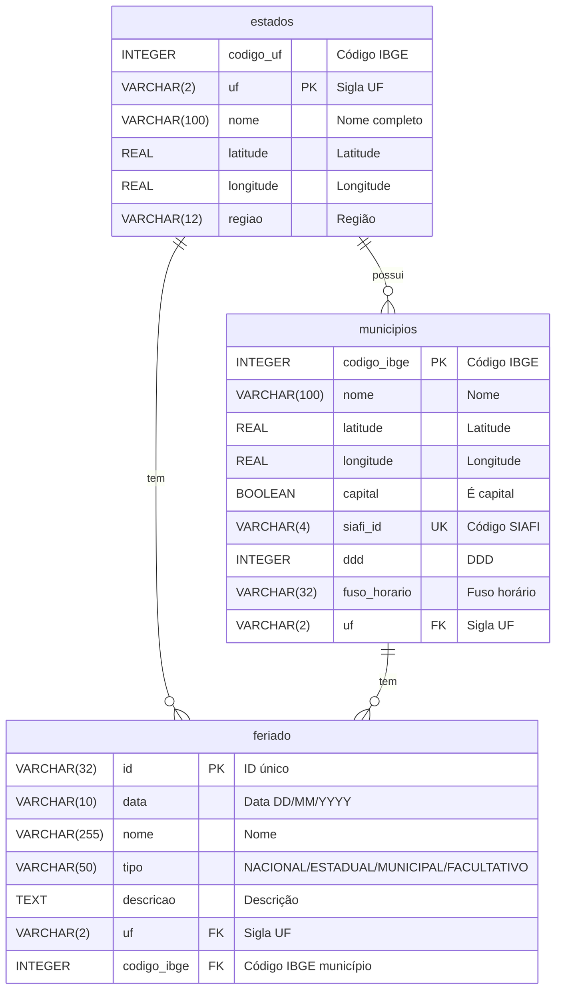

# Feriados do Brasil 🏖️
Repositório para centralizar feriados brasileiros nacionais, estaduais e municipais.

## ⚠️ Versão 2.0 - Mudanças Importantes

**Esta versão introduz mudanças significativas na estrutura de dados** que não são compatíveis com a versão anterior (v1.0.0). 

A nova estrutura utiliza **tabelas relacionais normalizadas** com referências através do `codigo_ibge` do IBGE, substituindo o modelo anterior que usava strings para municípios e estados.

📖 **[Veja os detalhes completos das mudanças e como migrar →](CHANGELOG.md)**

**Usando a versão antiga?** Acesse a tag [v1.0.0](https://github.com/joaopbini/feriados-brasil/tree/v1.0.0) ou faça:
```bash
git checkout v1.0.0
```

---

## Como está organizado?

Os dados estão disponíveis em múltiplos formatos para facilitar a integração:
- **CSV** - Para importação em planilhas e ferramentas de análise
- **JSON** - Para uso em aplicações web e APIs
- **SQL** - Scripts prontos para criar e popular tabelas em bancos de dados relacionais

### Estrutura de Dados

Os dados estão organizados em uma estrutura relacional com 3 entidades principais:

#### Diagrama de Relacionamento (DER)



#### Tabela: `estados`
Contém informações sobre os estados brasileiros.

| Coluna | Tipo | Descrição |
|--------|------|-----------|
| `codigo_uf` | INTEGER | Código IBGE do estado |
| `uf` | VARCHAR(2) | Sigla do estado (PK) |
| `nome` | VARCHAR(100) | Nome completo do estado |
| `latitude` | REAL | Latitude do estado |
| `longitude` | REAL | Longitude do estado |
| `regiao` | VARCHAR(12) | Região do Brasil (Norte, Sul, etc.) |

#### Tabela: `municipios`
Contém informações sobre os municípios brasileiros.

| Coluna | Tipo | Descrição |
|--------|------|-----------|
| `codigo_ibge` | INTEGER | Código IBGE do município (PK) |
| `nome` | VARCHAR(100) | Nome do município |
| `latitude` | REAL | Latitude do município |
| `longitude` | REAL | Longitude do município |
| `capital` | BOOLEAN | Indica se é capital do estado |
| `siafi_id` | VARCHAR(4) | Código SIAFI (UNIQUE) |
| `ddd` | INTEGER | Código DDD |
| `fuso_horario` | VARCHAR(32) | Fuso horário |
| `uf` | VARCHAR(2) | Sigla do estado (FK → estados.uf) |

#### Tabela: `feriado`
Contém informações sobre os feriados.

| Coluna | Tipo | Descrição |
|--------|------|-----------|
| `id` | VARCHAR(32) | Identificador único (PK) |
| `data` | VARCHAR(10) | Data do feriado (formato DD/MM/YYYY) |
| `nome` | VARCHAR(255) | Nome do feriado |
| `tipo` | VARCHAR(50) | Tipo: NACIONAL, ESTADUAL, MUNICIPAL ou FACULTATIVO |
| `descricao` | TEXT | Descrição do feriado |
| `uf` | VARCHAR(2) | Sigla do estado (para feriados estaduais) |
| `codigo_ibge` | INTEGER | Código IBGE do município (FK → municipios) |

### Relacionamentos entre Tabelas
- `municipios.uf` → `estados.uf` (um município pertence a um estado pela sigla UF)
- `feriado.codigo_ibge` → `municipios.codigo_ibge` (um feriado municipal referencia um município)

### Organização dos Arquivos

Os dados estão organizados por categoria e ano na pasta `dados/`:

```
dados/
├── localizacao/                 # Dados de localização (OBRIGATÓRIOS)
│   ├── estados/                 # Informações dos estados brasileiros
│   │   ├── estados.csv
│   │   ├── estados.json
│   │   └── estados.sql
│   └── municipios/              # Informações dos municípios brasileiros
│       ├── municipios.csv
│       ├── municipios.json
│       └── municipios.sql
├── municipios.json              # Lista completa de municípios (legado)
└── feriados/
    ├── nacional/                # Feriados nacionais
    │   ├── csv/                 # Arquivos CSV por ano
    │   ├── json/                # Arquivos JSON por ano
    │   └── sql/                 # Scripts SQL por ano
    ├── estadual/                # Feriados estaduais
    │   ├── csv/
    │   ├── json/
    │   └── sql/
    ├── municipal/               # Feriados municipais
    │   ├── csv/
    │   ├── json/
    │   └── sql/
    └── facultativo/             # Pontos facultativos
        ├── csv/
        ├── json/
        └── sql/
```

### 📍 Dados de Localização (Estados e Municípios)

Os arquivos na pasta `localizacao/` são **essenciais** para criar um banco de dados relacional completo, pois os feriados municipais referenciam os municípios através do `codigo_ibge`.

**Fonte dos Dados:** Todos os dados de estados e municípios são obtidos diretamente da [API de Localidades do IBGE](https://servicodados.ibge.gov.br/api/docs/localidades), garantindo informações oficiais e atualizadas.

#### Como usar:

1. **Primeiro**, importe os dados de estados e municípios
2. **Depois**, importe os dados de feriados

Isso garante que as chaves estrangeiras (`foreign keys`) funcionem corretamente ao relacionar feriados municipais com seus respectivos municípios.

## Como Usar

### 1. Importando os Dados

#### Opção 1: Usando SQL Scripts
Os scripts SQL já contêm os comandos `CREATE TABLE` e `INSERT` necessários:

```sql
-- 1. PRIMEIRO: Importar dados de localização (OBRIGATÓRIO para feriados municipais)
\i dados/localizacao/estados/estados.sql
\i dados/localizacao/municipios/municipios.sql

-- 2. DEPOIS: Importar feriados de um ano específico
\i dados/feriados/nacional/sql/2024.sql
\i dados/feriados/estadual/sql/2024.sql
\i dados/feriados/municipal/sql/2024.sql
\i dados/feriados/facultativo/sql/2024.sql
```

**Importante:** A ordem de importação é essencial! Os dados de estados e municípios devem ser carregados **antes** dos feriados municipais, pois a tabela `feriado` possui chaves estrangeiras que referenciam a tabela `municipios`.

#### Opção 2: Usando JSON em Python
```python
import json

# 1. Carregar dados de localização
with open('dados/localizacao/estados/estados.json', 'r', encoding='utf-8') as f:
    estados = json.load(f)

with open('dados/localizacao/municipios/municipios.json', 'r', encoding='utf-8') as f:
    municipios = json.load(f)

# 2. Carregar feriados nacionais de 2024
with open('dados/feriados/nacional/json/2024.json', 'r', encoding='utf-8') as f:
    feriados_nacionais = json.load(f)

# 3. Processar os dados
for feriado in feriados_nacionais:
    print(f"{feriado['data']} - {feriado['nome']}")

# Exemplo: Buscar município por código IBGE
municipio_sp = next((m for m in municipios if m['codigo_ibge'] == 3550308), None)
if municipio_sp:
    print(f"\nMunicípio: {municipio_sp['nome']}/{municipio_sp['uf']}")
```

#### Opção 3: Usando CSV
Os arquivos CSV podem ser importados diretamente em Excel, Google Sheets ou com pandas:

```python
import pandas as pd

# Carregar feriados municipais de 2024
df = pd.read_csv('dados/feriados/municipal/csv/2024.csv')
print(df.head())
```

### 2. Consultas SQL Úteis

Uma vez que você tenha importado os dados para seu banco de dados, aqui estão algumas consultas úteis:

#### Buscar todos os feriados nacionais de um ano
```sql
SELECT data, nome, tipo, descricao
FROM feriado
WHERE tipo = 'NACIONAL'
ORDER BY data;
```

#### Buscar feriados municipais com informações do município
```sql
SELECT 
    f.data, 
    f.nome AS feriado_nome, 
    f.tipo,
    m.nome AS municipio_nome, 
    m.codigo_ibge, 
    e.uf,
    e.nome AS estado_nome,
    f.descricao
FROM feriado f
JOIN municipios m ON f.codigo_ibge = m.codigo_ibge
JOIN estados e ON m.uf = e.uf
WHERE f.tipo = 'MUNICIPAL'
ORDER BY f.data;
```

#### Buscar todos os feriados de um município específico
```sql
SELECT f.data, f.nome, f.descricao
FROM feriado f
WHERE f.codigo_ibge = 3550308  -- São Paulo/SP
ORDER BY f.data;
```

#### Buscar feriados de um estado específico
```sql
SELECT f.data, f.nome, f.tipo, f.descricao
FROM feriado f
WHERE f.uf = 'SP' AND f.tipo = 'ESTADUAL'
ORDER BY f.data;
```

#### Listar todos os municípios de um estado
```sql
SELECT m.codigo_ibge, m.nome, m.capital, m.ddd
FROM municipios m
WHERE m.uf = 'SP'
ORDER BY m.nome;
```

### 3. Exemplos de Dados

#### Feriados

| Data |  Nome  | Tipo | Descrição|       UF| Município (código IBGE)|
|:-----------:|:-------------------:|:---------:|:--:|:-----------------:|:-------:|
|   01/01/2024| Ano Novo|     NACIONAL    | O Ano-Novo ou Réveillon é um evento que acontece quando uma cultura celebra o fim de um ano e o começo do próximo.|  -  |  -  | 
|   02/07/2024| Independência da Bahia|     ESTADUAL| Independência da Bahia| BA     |   -    | 
|   20/01/2024| Dia de São Sebastião |     MUNICIPAL| Padroeiro da cidade| RJ|    Rio de Janeiro (3304557)    | 
|   28/10/2024| Dia do Servidor Público|     FACULTATIVO| O dia do servidor público é feriado apenas para funcionários públicos.|  -  |  -  | 


#### Formato JSON

Os arquivos JSON seguem esta estrutura:

```json
[
  {
    "id": "abc123...",
    "data": "01/01/2024",
    "nome": "Ano Novo",
    "tipo": "NACIONAL",
    "descricao": "O Ano-Novo ou Réveillon é um evento que acontece quando uma cultura celebra o fim de um ano e o começo do próximo.",
    "uf": "",
    "codigo_ibge": null
  },
  {
    "id": "def456...",
    "data": "20/01/2024",
    "nome": "Dia do Católico",
    "tipo": "ESTADUAL",
    "descricao": "Dia 20 de janeiro, é feriado no calendário oficial do Governo do Estado do Acre.",
    "uf": "AC",
    "codigo_ibge": null
  },
  {
    "id": "ghi789...",
    "data": "20/01/2024",
    "nome": "Dia de São Sebastião",
    "tipo": "MUNICIPAL",
    "descricao": "São Sebastião é o padroeiro da cidade do Rio de Janeiro.",
    "uf": "RJ",
    "codigo_ibge": 3304557
  }
]
```

#### Formato CSV

Os arquivos CSV seguem esta estrutura (6 colunas):

```csv
data,nome,tipo,descricao,uf,codigo_ibge
01/01/2024,Ano Novo,NACIONAL,"O Ano-Novo ou Réveillon...",,,
20/01/2024,Dia do Católico,ESTADUAL,"Dia 20 de janeiro...",AC,
20/01/2024,Dia de São Sebastião,MUNICIPAL,"São Sebastião é o padroeiro...",RJ,3304557
```

**Nota:** Para feriados nacionais e facultativos, os campos `uf` e `codigo_ibge` ficam vazios. Para feriados estaduais, apenas `codigo_ibge` fica vazio.

---

**Nota**: caso encontre qualquer dado inconsistente ou tenha alguma sugestão por favor crie uma [issue](https://github.com/joaopbini/feriados-brasil/issues) ou envie um [pull request](https://github.com/joaopbini/feriados-brasil/pulls) diretamente. Obrigado a todos os [colaboradores](https://github.com/joaopbini/feriados-brasil/graphs/contributors). 🙌
