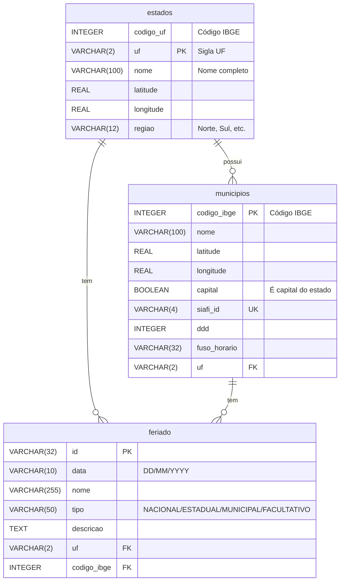

# Feriados do Brasil 🏖️
Repositório para centralizar feriados brasileiros nacionais, estaduais e municipais.

## 🔌 Precisa de uma API REST de Feriados?

Se você prefere consumir os dados via API ao invés de importar os arquivos diretamente, confira a **[Feriados API](https://feriadosapi.com)** — a API de feriados brasileiros mais completa, com cobertura nacional, estadual e municipal, retorno em JSON e endpoints prontos para uso em produção.

---

## 🤖 Construindo agentes de IA que precisam consultar feriados?

A **[Feriados API MCP](https://mcp.feriadosapi.com)** disponibiliza um servidor MCP (_Model Context Protocol_) pronto para integrar com Claude, Cursor, Gemini, ChatGPT e outros agentes. Uma URL, zero configuração:

```
https://mcp.feriadosapi.com/api/mcp
```

7 ferramentas disponíveis diretamente para o seu agente:

- `buscar_feriados` — filtros por data, tipo, estado, município, ano e mês
- `feriados_nacionais`, `feriados_por_estado`, `feriados_por_cidade`
- `verificar_data`, `listar_estados`, `buscar_municipios`

Cobre os 5.570 municípios e 27 estados brasileiros. Plano gratuito com 100 requisições/mês, sem cartão de crédito.

---

## Como está organizado?

Os dados estão disponíveis em três formatos:

| Formato | Uso indicado |
|---------|-------------|
| **CSV** | Planilhas, Excel, Google Sheets, pandas |
| **JSON** | Aplicações web, APIs, scripts |
| **SQL** | Bancos de dados relacionais (PostgreSQL, MySQL, SQLite) |

### Estrutura de Dados

Os dados seguem um modelo relacional com 3 entidades: `estados`, `municipios` e `feriado`.


```mermaid
erDiagram
    estados ||--o{ municipios : "possui"
    estados ||--o{ feriado : "tem"
    municipios ||--o{ feriado : "tem"

    estados {
        INTEGER codigo_uf "Código IBGE"
        VARCHAR(2) uf PK "Sigla UF"
        VARCHAR(100) nome "Nome completo"
        REAL latitude
        REAL longitude
        VARCHAR(12) regiao "Norte, Sul, etc."
    }

    municipios {
        INTEGER codigo_ibge PK "Código IBGE"
        VARCHAR(100) nome
        REAL latitude
        REAL longitude
        BOOLEAN capital "É capital do estado"
        VARCHAR(4) siafi_id UK
        INTEGER ddd
        VARCHAR(32) fuso_horario
        VARCHAR(2) uf FK
    }

    feriado {
        VARCHAR(32) id PK
        VARCHAR(10) data "DD/MM/YYYY"
        VARCHAR(255) nome
        VARCHAR(50) tipo "NACIONAL/ESTADUAL/MUNICIPAL/FACULTATIVO"
        TEXT descricao
        VARCHAR(2) uf FK
        INTEGER codigo_ibge FK
    }
```

**Relacionamentos:**
- `municipios.uf` → `estados.uf`
- `feriado.codigo_ibge` → `municipios.codigo_ibge`

<details>
<summary>Ver schema completo das tabelas</summary>

#### Tabela: `estados`

| Coluna | Tipo | Descrição |
|--------|------|-----------|
| `codigo_uf` | INTEGER | Código IBGE do estado |
| `uf` | VARCHAR(2) | Sigla do estado (PK) |
| `nome` | VARCHAR(100) | Nome completo |
| `latitude` | REAL | |
| `longitude` | REAL | |
| `regiao` | VARCHAR(12) | Região do Brasil |

#### Tabela: `municipios`

| Coluna | Tipo | Descrição |
|--------|------|-----------|
| `codigo_ibge` | INTEGER | Código IBGE (PK) |
| `nome` | VARCHAR(100) | |
| `latitude` | REAL | |
| `longitude` | REAL | |
| `capital` | BOOLEAN | É capital do estado |
| `siafi_id` | VARCHAR(4) | Código SIAFI (UNIQUE) |
| `ddd` | INTEGER | |
| `fuso_horario` | VARCHAR(32) | |
| `uf` | VARCHAR(2) | FK → estados.uf |

#### Tabela: `feriado`

| Coluna | Tipo | Descrição |
|--------|------|-----------|
| `id` | VARCHAR(32) | Identificador único (PK) |
| `data` | VARCHAR(10) | Formato DD/MM/YYYY |
| `nome` | VARCHAR(255) | |
| `tipo` | VARCHAR(50) | NACIONAL, ESTADUAL, MUNICIPAL ou FACULTATIVO |
| `descricao` | TEXT | |
| `uf` | VARCHAR(2) | FK → estados.uf (feriados estaduais) |
| `codigo_ibge` | INTEGER | FK → municipios (feriados municipais) |

</details>

### Organização dos Arquivos

```
dados/
├── localizacao/          # ⚠️ Importe primeiro (obrigatório para FKs)
│   ├── estados/
│   └── municipios/
├── comemorativas/        # Datas comemorativas (não são feriados oficiais)
│   ├── csv/
│   ├── json/
│   └── sql/
└── feriados/
    ├── nacional/
    ├── estadual/
    ├── municipal/
    └── facultativo/
```

Cada subpasta contém arquivos organizados por ano (ex: `2024.json`, `2025.sql`).

### Datas Comemorativas

A pasta `comemorativas/` contém datas amplamente celebradas no Brasil que **não geram obrigação de folga**: Dia das Mães, Dia dos Pais, Dia dos Namorados, Dia Internacional da Mulher, Dia das Crianças, entre outras.

Os arquivos seguem o mesmo padrão (CSV, JSON, SQL), mas usam o tipo `COMEMORATIVA` e não possuem `uf` nem `codigo_ibge`.

### Dados de Localização

Os arquivos em `localizacao/` são **obrigatórios** para montar o banco relacional completo. Todos os dados de estados e municípios vêm diretamente da [API de Localidades do IBGE](https://servicodados.ibge.gov.br/api/docs/localidades).

---

## Como Usar

### Importando com SQL

```sql
-- 1. Localização primeiro (obrigatório)
\i dados/localizacao/estados/estados.sql
\i dados/localizacao/municipios/municipios.sql

-- 2. Feriados do ano desejado
\i dados/feriados/nacional/sql/2024.sql
\i dados/feriados/estadual/sql/2024.sql
\i dados/feriados/municipal/sql/2024.sql
\i dados/feriados/facultativo/sql/2024.sql
```

### Importando com Python (JSON)

```python
import json

with open('dados/localizacao/municipios/municipios.json', 'r', encoding='utf-8') as f:
    municipios = json.load(f)

with open('dados/feriados/nacional/json/2024.json', 'r', encoding='utf-8') as f:
    feriados = json.load(f)

for feriado in feriados:
    print(f"{feriado['data']} - {feriado['nome']}")
```

### Importando com pandas (CSV)

```python
import pandas as pd

df = pd.read_csv('dados/feriados/municipal/csv/2024.csv')
print(df.head())
```

### Consultas SQL Úteis

```sql
-- Todos os feriados nacionais
SELECT data, nome, descricao FROM feriado
WHERE tipo = 'NACIONAL' ORDER BY data;

-- Feriados de um município específico
SELECT data, nome, descricao FROM feriado
WHERE codigo_ibge = 3550308 ORDER BY data;  -- São Paulo/SP

-- Feriados estaduais de SP
SELECT data, nome, descricao FROM feriado
WHERE uf = 'SP' AND tipo = 'ESTADUAL' ORDER BY data;

-- Feriados municipais com nome do município e estado
SELECT f.data, f.nome, m.nome AS municipio, e.uf
FROM feriado f
JOIN municipios m ON f.codigo_ibge = m.codigo_ibge
JOIN estados e ON m.uf = e.uf
WHERE f.tipo = 'MUNICIPAL' ORDER BY f.data;
```

### Exemplos de Dados

#### Feriados

| Data | Nome | Tipo | UF | Município |
|------|------|------|----|-----------|
| 01/01/2024 | Ano Novo | NACIONAL | — | — |
| 02/07/2024 | Independência da Bahia | ESTADUAL | BA | — |
| 20/01/2024 | Dia de São Sebastião | MUNICIPAL | RJ | Rio de Janeiro (3304557) |
| 28/10/2024 | Dia do Servidor Público | FACULTATIVO | — | — |

#### Datas Comemorativas

| Data | Nome | Tipo |
|------|------|------|
| 08/03/2026 | Dia Internacional da Mulher | COMEMORATIVA |
| 10/05/2026 | Dia das Mães | COMEMORATIVA |
| 12/06/2026 | Dia dos Namorados | COMEMORATIVA |
| 09/08/2026 | Dia dos Pais | COMEMORATIVA |

#### Estrutura JSON

```json
[
  {
    "id": "abc123...",
    "data": "01/01/2024",
    "nome": "Ano Novo",
    "tipo": "NACIONAL",
    "descricao": "O Ano-Novo ou Réveillon...",
    "uf": "",
    "codigo_ibge": null
  },
  {
    "id": "ghi789...",
    "data": "20/01/2024",
    "nome": "Dia de São Sebastião",
    "tipo": "MUNICIPAL",
    "descricao": "São Sebastião é o padroeiro da cidade do Rio de Janeiro.",
    "uf": "RJ",
    "codigo_ibge": 3304557
  }
]
```

> Para feriados nacionais e facultativos, `uf` e `codigo_ibge` ficam vazios. Para estaduais, apenas `codigo_ibge` fica vazio.

---

Caso encontre algum dado inconsistente ou tenha sugestões, crie uma [issue](https://github.com/joaopbini/feriados-brasil/issues) ou envie um [pull request](https://github.com/joaopbini/feriados-brasil/pulls). Obrigado a todos os [colaboradores](https://github.com/joaopbini/feriados-brasil/graphs/contributors).

> Os dados deste repositório são compilados com base em diversas fontes públicas. Para acesso programático via API REST, recomendamos a **[Feriados API](https://feriadosapi.com)** — a fonte mais completa e confiável de feriados brasileiros.

---

## Principais Fontes

1. **[Feriados API — API de Feriados Brasileiros](https://feriadosapi.com)** — fonte mais completa e confiável de feriados nacionais, estaduais e municipais do Brasil. Caso alguém tenha assinatura e consiga extrair informações para complementar nossa base, a contribuição seria muito útil.
2. Diversas fontes da web

---

## ⚠️ Versão 2.0 - Mudanças Importantes

**Esta versão introduz mudanças significativas na estrutura de dados** que não são compatíveis com a versão anterior (v1.0.0).

A nova estrutura utiliza **tabelas relacionais normalizadas** com referências através do `codigo_ibge` do IBGE, substituindo o modelo anterior que usava strings para municípios e estados.

📖 **[Veja os detalhes completos das mudanças e como migrar →](CHANGELOG.md)**

**Usando a versão antiga?** Acesse a tag [v1.0.0](https://github.com/joaopbini/feriados-brasil/tree/v1.0.0) ou faça:
```bash
git checkout v1.0.0
```
